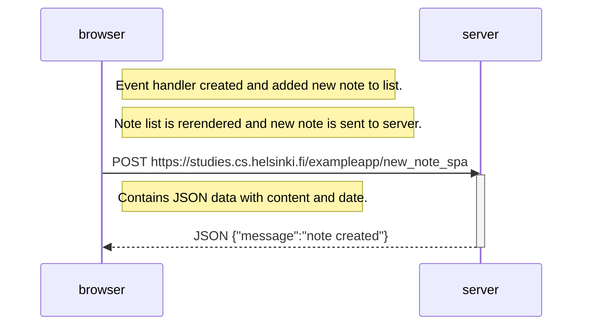

```mermaid
sequenceDiagram
    Note right of browser: Event handler created and added new note to list.
    Note right of browser: Note list is rerendered and new note is sent to server.
    browser->>server: POST https://studies.cs.helsinki.fi/exampleapp/new_note_spa
    activate server
    Note right of browser: Contains JSON data with content and date. 
    server-->>browser: JSON {"message":"note created"}
    deactivate server
```